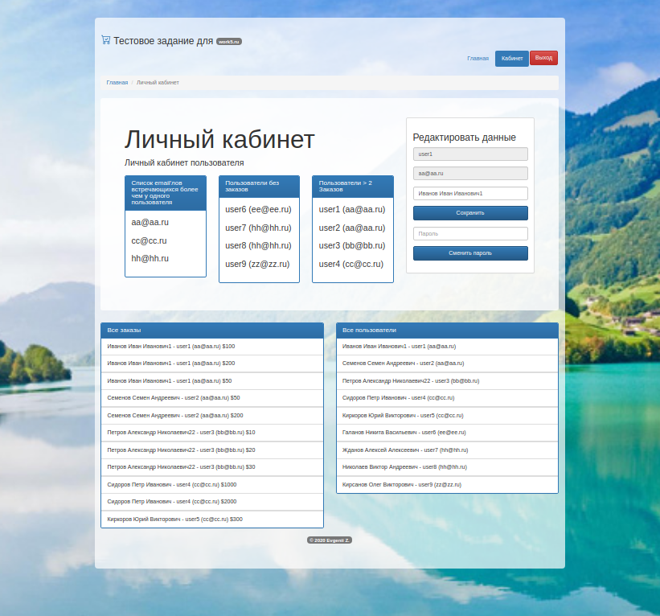

# Test task №1
* PHP
```sh
Create a application with users authorization.
Implement the ability to register a user (email, login, password, full name). 
When you auth your "personal account" you can change your password and full name.

Use "pure" PHP 5.6 and higher (without frameworks) and MySQL 5.5 and higher. 
Design is not important, layout is also simple.
Deadline: 2 days.
```
* SQL
```sh
There are 2 tables.
users table:

users
----------
`id` int(11)
`email` varchar(55)
`login` varchar(55)

and order table:

orders
--------
`id` int(11)
`user_id` int(11)
`price` int(11)

You will need compose a query that will display:
* A list of email arddresses those have more than one user.
* List of usernames who have not made a single order.
* List of usernames who have made more than 2 orders.
```
### Requirements
   The requirements to application is:
   *    **PHP - Supported Versions**: >= 7
   *    **Webserver**: Nginx or Apache
   *    **Database**: MySQL, or Maria DB

### Installation

#### 1. Git Clone
   ```sh
   $ git clone https://github.com/evgeniizab/php.tasks.1.git
   $ cd php.tasks.1
   ```
#### 2. Database
Copy app/config/db_php to app/config/db.php
```sh
$ cp app/config/db_php app/config/db.php
```
Edit app/config/db.php
```sh
return [
    'db_host' => '127.0.0.1',
    'db_port' => '3306',
    'db_name' => 'xxx',
    'db_user' => 'xxx',
    'db_password' => 'xxx',
];

```
Import DB base.sql
```sh
mysql -u USERNAME -p -h localhost BASENAME < base.sql 
```
#### 3. Install packages and run tests (17 tests)
```sh
composer install
./vendor/bin/phpunit 
```
#### 4. Open the application in a browser

